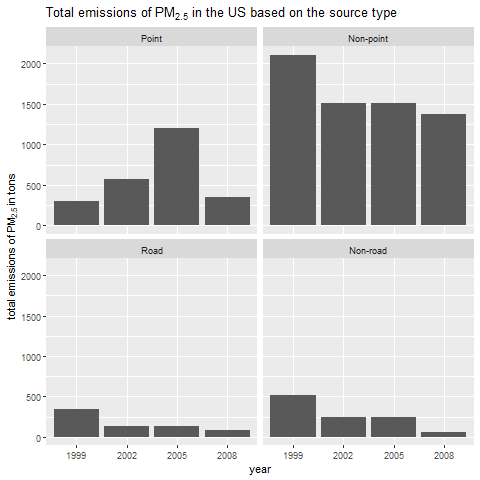
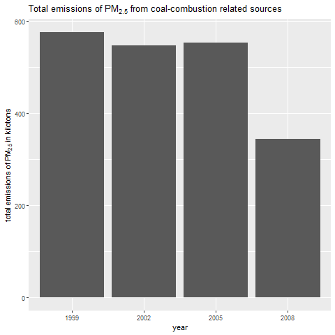

# Exploratory Data Analysis - Course Project 2
This is the Exploratory Data Analysis - Course Project 2.

## Introduction
Fine particulate matter (PM2.5) is an ambient air pollutant for which there is strong evidence that it is harmful to human health. In the United States, the Environmental Protection Agency (EPA) is tasked with setting national ambient air quality standards for fine PM and for tracking the emissions of this pollutant into the atmosphere. Approximatly every 3 years, the EPA releases its database on emissions of PM2.5. This database is known as the National Emissions Inventory (NEI). You can read more information about the NEI at the [EPA National Emissions Inventory](http://www.epa.gov/ttn/chief/eiinformation.html) web site.

For each year and for each type of PM source, the NEI records how many tons of PM2.5 were emitted from that source over the course of the entire year. The data that you will use for this assignment are for 1999, 2002, 2005, and 2008.

## Data
The data for this assignment are available from the course web site as a single zip file:

* [Data for Peer Assessment [29Mb]](https://d396qusza40orc.cloudfront.net/exdata%2Fdata%2FNEI_data.zip)

The zip file contains two files:

PM2.5 Emissions Data (`summarySCC_PM25.rds`): This file contains a data frame with all of the PM2.5 emissions data for 1999, 2002, 2005, and 2008. For each year, the table contains number of tons of PM2.5 emitted from a specific type of source for the entire year. Here are the first few rows.
````
##     fips      SCC Pollutant Emissions  type year
## 4  09001 10100401  PM25-PRI    15.714 POINT 1999
## 8  09001 10100404  PM25-PRI   234.178 POINT 1999
## 12 09001 10100501  PM25-PRI     0.128 POINT 1999
## 16 09001 10200401  PM25-PRI     2.036 POINT 1999
## 20 09001 10200504  PM25-PRI     0.388 POINT 1999
## 24 09001 10200602  PM25-PRI     1.490 POINT 1999
````

* `fips`: A five-digit number (represented as a string) indicating the U.S. county
* `SCC`: The name of the source as indicated by a digit string (see source code classification table)
* `Pollutant`: A string indicating the pollutant
* `Emissions`: Amount of PM2.5 emitted, in tons
* `type`: The type of source (point, non-point, on-road, or non-road)
* `year`: The year of emissions recorded

Source Classification Code Table (`Source_Classification_Code.rds`): This table provides a mapping from the SCC digit strings int he Emissions table to the actual name of the PM2.5 source. The sources are categorized in a few different ways from more general to more specific and you may choose to explore whatever categories you think are most useful. For example, source “10100101” is known as “Ext Comb /Electric Gen /Anthracite Coal /Pulverized Coal”.

You can read each of the two files using the `readRDS()` function in R. For example, reading in each file can be done with the following code:

````
## This first line will likely take a few seconds. Be patient!
NEI <- readRDS("summarySCC_PM25.rds")
SCC <- readRDS("Source_Classification_Code.rds")
````

as long as each of those files is in your current working directory (check by calling `dir()` and see if those files are in the listing).

## Assignment

The overall goal of this assignment is to explore the National Emissions Inventory database and see what it say about fine particulate matter pollution in the United states over the 10-year period 1999–2008. You may use any R package you want to support your analysis.

### Questions
    
1. Have *total* emissions from PM2.5 decreased in the United States from 1999 to 2008? Using the **base** plotting system, make a plot showing the *total* PM2.5 emission from all sources for each of the years 1999, 2002, 2005, and 2008.

2. Have *total* emissions from PM2.5 decreased in the **Baltimore City**, Maryland (`fips == "24510"`) from 1999 to 2008? Use the **base** plotting system to make a plot answering this question.

3. Of the four types of sources indicated by the **type** (point, nonpoint, onroad, nonroad) variable, which of these four sources have seen decreases in emissions from 1999–2008 for **Baltimore City**? Which have seen increases in emissions from 1999–2008? Use the **ggplot2** plotting system to make a plot answer this question.

4. Across the United States, how have emissions from coal combustion-related sources changed from 1999–2008?

5. How have emissions from motor vehicle sources changed from 1999–2008 in **Baltimore City**?

6. Compare emissions from motor vehicle sources in **Baltimore City** with emissions from motor vehicle sources in **Los Angeles** County, California (`fips == "06037"`). Which city has seen greater changes over time in motor vehicle emissions?

## Answers
Two Tidyverse packages are required for this project `dplyr` and `ggplot2`.

We can check if they are installed and loaded using this code:
```
if(!require(dplyr)){
  install.packages("dplyr")
  library(dplyr)
}

if(!require(ggplot2)){
  install.packages("ggplot2")
  library(ggplot2)
}
```

At the beginning, we need to load the datasets to continue with:
```
NEI <- readRDS("summarySCC_PM25.rds")
SCC <- readRDS("Source_Classification_Code.rds")
```

### Question 1
Have total emissions from PM2.5 decreased in the United States from 1999 to 2008? Using the **base** plotting system, make a plot showing the *total* PM2.5 emission from all sources for each of the years 1999, 2002, 2005, and 2008.

Data preparation - we summarized the NEI dataset to obtain sum of `Emissions` for particular year.
```
NEI_summarized <- NEI %>%
  as_tibble() %>% 
  group_by(year) %>% 
  summarize(total = sum(Emissions))
```

Using the `base` plotting system, we plotted the total PM[2.5] emissions in the US for years 1999 to 2008.
```
with(NEI_summarized,
     barplot(height = total/10^6,
             names.arg = year,
             main = expression("Total emissions of PM" [2.5]* " in the US for years 1999 to 2008"),
             xlab = "year",
             ylab = expression("total emissions of PM" [2.5]* " in millions of tons")))
```

**Plot 1 shows small decrease in total emissions in the US from 1999 to 2008.**


### Question 2
Have *total* emissions from PM2.5 decreased in the **Baltimore City**, Maryland (`fips == "24510"`) from 1999 to 2008? Use the **base** plotting system to make a plot answering this question.

Data preparation - we summarized the NEI dataset to obtain sum of `Emissions` for particular year and filtered it out for Baltimore city.
```
NEI_summarized <- NEI %>%
  as_tibble() %>% 
  group_by(fips, year) %>% 
  summarize(total = sum(Emissions)) %>% 
  filter(fips == "24510")
```

Using the `base` plotting system, we plotted the total PM[2.5] emissions for Baltimore city for years 1999 to 2008.
```
with(NEI_summarized,
     barplot(height = total,
             names.arg = year,
             main = expression("Total emissions of PM" [2.5]* " in the Baltimore City, MD from 1999 to 2008"),
             xlab = "year",
             ylab = expression("total emissions of PM" [2.5]* " in tons")))
```

**Plot 2 shows alternating increases and decreases in total emissions in Baltimore city from 1999 to 2008. However, in 2008, the *total* level of PM[2.5] Emissions was at its lowest point.**


### Question 3
Of the four types of sources indicated by the **type** (point, nonpoint, onroad, nonroad) variable, which of these four sources have seen decreases in emissions from 1999–2008 for **Baltimore City**? Which have seen increases in emissions from 1999–2008? Use the **ggplot2** plotting system to make a plot answer this question.

Data preparation - we summarized the NEI dataset to obtain sum of `Emissions` for particular year, filtered it out for Baltimore city and split according to the source `type`.
```
NEI_summarized <- NEI %>%
  as_tibble() %>% 
  group_by(type, fips, year) %>% 
  summarize(total = sum(Emissions)) %>% 
  filter(fips == "24510")

NEI_summarized$year = as.factor(NEI_summarized$year)
NEI_summarized$type = as.factor(NEI_summarized$type)
levels(NEI_summarized$type) <- c("Non-road", "Non-point", "Road", "Point")
NEI_summarized$type <- factor(NEI_summarized$type, levels = c("Point", "Non-point", "Road", "Non-road"))
```

Using the `ggplot2` plotting system, we plotted the total PM[2.5] emissions for Baltimore city for years 1999 to 2008 splitted by the source type.
```
ggplot(NEI_summarized, aes(x = year, y = total)) +
  geom_col() +
  facet_wrap(vars(type)) +
  guides(fill = F) +
  labs(
    title = expression(
      "Total emissions of PM" [2.5] * " in the US based on the source type"
    ),
    y = expression("total emissions of PM" [2.5]* " in tons")
  )
```

**Plot 3 shows in most cases decrease in total emissions in Baltimore city from 1999 to 2008.



### Question 4
Across the United States, how have emissions from coal combustion-related sources changed from 1999–2008?

Data preparation - we joined the `NEI` and `SCC` datasets together by `SCC` variable, filtered the newly obtained dataset for "Coal Comb" and calculated the total emissions for each year 1999 to 2008.
```
data <- NEI %>%
  as_tibble() %>%
  inner_join(SCC, by = "SCC") %>%
  filter(grepl("Comb|comb", Short.Name) & grepl("Coal|coal", Short.Name)) %>% 
  group_by(year) %>% 
  summarize(total = sum(Emissions))
```
 
Using the `ggplot2` plotting system, we plotted the total PM[2.5] emissions from coal-combustion related sources for years 1999 to 2008. 
```
ggplot(data, aes(x = factor(year), y = total/1000)) +
 geom_col() +
 labs(title = expression("Total emissions of PM" [2.5]* " from coal-combustion related sources"),
      x = "year",
      y = expression("total emissions of PM" [2.5]* " in kilotons"))
```
 
**Plot 4 shows that total PM[2.5] emissions from coal-combustion related sources rapidly decreased in 2008.**
 

 
### Question 5
How have emissions from motor vehicle sources changed from 1999–2008 in **Baltimore City**?
 
Data preparation - we joined the `NEI` and `SCC` datasets together by `SCC` variable, filtered the newly obtained dataset for "Highway Vehicles", calculated the total emissions for each fips and year 1999 to 2008 and filtered it out again for Baltimore city.
```
data <- NEI %>%
  as_tibble() %>%
  inner_join(SCC, by = "SCC") %>%
  filter(grepl("Highway Vehicles", SCC.Level.Two)) %>% 
  group_by(fips, year) %>% 
  summarize(total = sum(Emissions)) %>% 
  filter(fips == "24510")
```

Using the `ggplot2` plotting system, we plotted the total PM[2.5] emissions from motor vehicles in Baltimore city for years 1999 to 2008.
```
ggplot(data, aes(x = factor(year), y = total)) +
  geom_col() +
  labs(title = expression("Total emissions of PM" [2.5]* " from motor vehicles in Baltimore city, MD"),
       x = "year",
       y = expression("total emissions of PM" [2.5]* " in tons"))
```

**Plot 5 shows that total PM[2.5] emissions from motor vehicles rapidly decreased even as early as 2002 and the slight decline continued until 2008.**
 


### Question 6
Compare emissions from motor vehicle sources in **Baltimore City** with emissions from motor vehicle sources in **Los Angeles** County, California (`fips == "06037"`). Which city has seen greater changes over time in motor vehicle emissions?

Data preparation - we joined the `NEI` and `SCC` datasets together by `SCC` variable, filtered the newly obtained dataset for "Highway Vehicles", calculated the total emissions for each fips and year 1999 to 2008 and filtered it out again for Baltimore city and Los Angeles.
```
data <- NEI %>%
  as_tibble() %>%
  inner_join(SCC, by = "SCC") %>%
  filter(grepl("Highway Vehicles", SCC.Level.Two)) %>% 
  group_by(fips, year) %>% 
  summarize(total = sum(Emissions)) %>% 
  filter(fips %in% c("06037", "24510")) %>% 
  mutate(city = if_else(fips == "24510", "Baltimore city", "Los Angeles"))
```

Using the `ggplot2` plotting system, we plotted the total PM[2.5] emissions from motor vehicles in Baltimore city and Los Angeles for years 1999 to 2008.
```
ggplot(data, aes(x = factor(year), y = total)) +
  geom_col() +
  facet_grid(cols = vars(city)) + 
  labs(title = expression("Total emissions of PM" [2.5]* " from motor vehicles in selected cities"),
       x = "year",
       y = expression("total emissions of PM" [2.5]* " in tons"))
```

**Plot 6 shows that total PM[2.5] emissions from motor vehicles in Baltimore city rapidly decreased even as early as 2002 and the decline continued until 2008. On the other hand total PM[2.5] emissions from motor vehicles in Los Angeles increased first but decline was apparent in 2008.**
 

